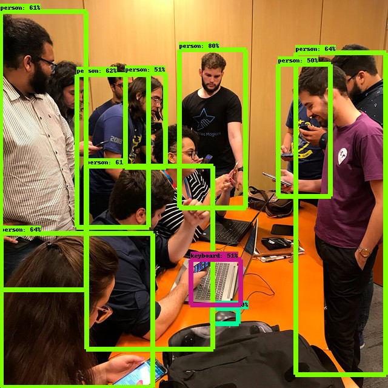
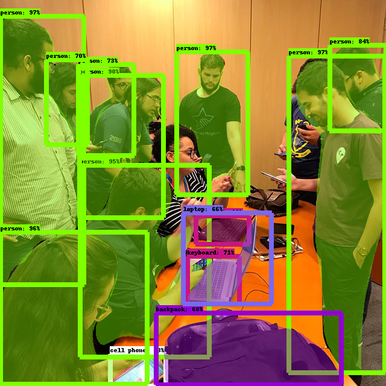

# Webinars Campus Mobile

## [beOn: IA - Reconhecimento de imagens](https://www.youtube.com/watch?v=NUfQxBqnnp4)

por Feliphe Galiza

Link do webinar: https://www.youtube.com/watch?v=NUfQxBqnnp4

|  Detecção de Objetos        |  Segmentação de Instâncias     |
:--------------------------- :|:-------------------------------:
|         |       |
|        |
|   |
|        |

Fonte das imagens: https://www.institutonetclaroembratel.org.br/nossas-novidades/viagem-ao-vale-do-silicio-encerra-7a-edicao-do-programa-campus-mobile/